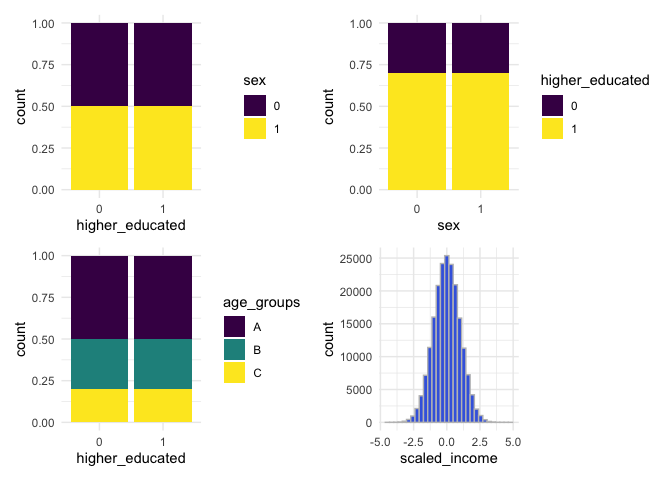
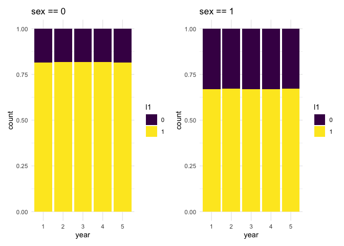
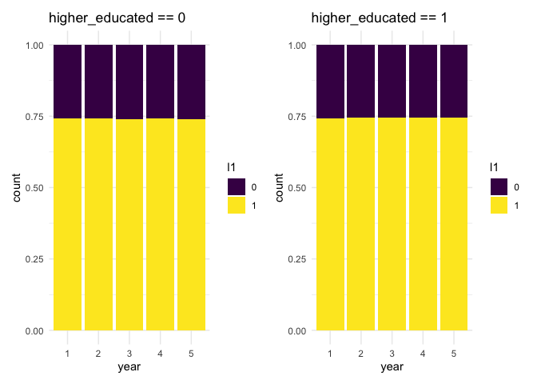
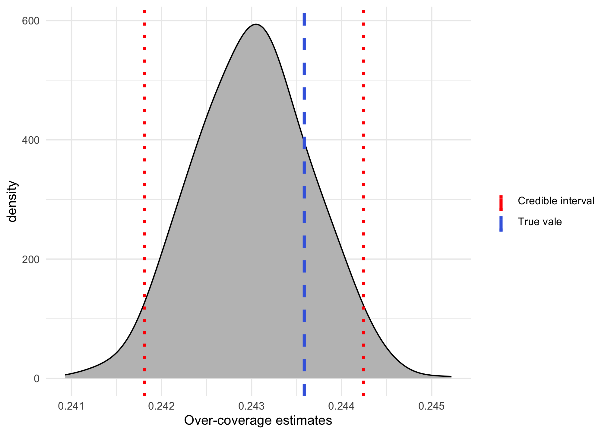

<!-- README.md is generated from README.Rmd. Please edit that file -->

# overcoverage 

A package to estimate overcoverage on register based data considering
Multiple System Estimation (MSE) models, based on the package `conting`.

The discussion of this method is available on the paper:

- Mussino, E., Santos, B., Monti, A. et al. Multiple systems estimation
  for studying over-coverage and its heterogeneity in population
  registers. **Quality & Quantity** (2023).
  <https://doi.org/10.1007/s11135-023-01757-x>

## Prerequisites

Before using this package, you need to install the archived package
`conting`. Because the package is archived, we need to install it in a
different way. Using the package `devtools`, we can use the following
code

``` r
devtools::install_version("conting",
                          version = "1.7")
```

After installing `conting`, you can install our package, also using
`devtools` with the following lines

``` r
devtools::install_github("brsantos/overcoverage")
```

## Creating a population

Because this type of data is sensitive and not publicly available, we
create functions that are able to recreate similar scenarios to showcase
the use of this package.

First, we can create a general database, with a similar purpose as the
Register of Total Population (RTB) in Sweden. We assume that if someone
enter the country, they are definitely in this dataset. For this use the
function `create_population`.

We can define how many people enter the country each year, for the
purpose of comparison with different countries, for instance. We can
create dummy variables, that could represent information such as sex
(male or female), employed (yes or no), among others. We can create
numerical variables that could represent income, age, time in the
country, etc. And lastly, we can create factor variables with three
levels. These could represent age groups, income groups or any other
type of grouping.

In case there is interest in another type of variable, adaptation for
this function are easy to implement. The binary variables are able to
receive the proportion of successful cases, for instance. We can easily
create a binary variable with equal proportion in the population, such
as sex, or we could create a variable with the proportion of people
employed, with values higher than 0.5 for example.

In the following example, we show how to create a population of 200,000
individuals. We create 2 binary variables, with names `sex` and
`higher_educated`. One categorical variable named `age_groups` and
numerical variable called `scaled_income`. By default, the categories
for the factor variable are sampled with probabilities 0.5, 0.3 and 0.2,
but this can be changed.

``` r
set.seed(42)

library(overcoverage)

main_pop <- create_population(
   size = 2e5,
   n_bin = 2, 
   n_cont_var = 1,
   n_cat_var = 1,
   prob_bin = c(0.5, 0.7), 
   names_bin = c("sex", "higher_educated"), 
   names_cont = "scaled_income", 
   names_cat_var = "age_groups")
```

We can make plots to look at their distribution across the population.
Because each variable is independent from the other, it seems that are
bars have the same height, but there are slightly variations in each one
of the bars.

``` r
library(ggplot2)
library(patchwork)

g <- ggplot(main_pop) + theme_minimal()
g1 <- g + geom_bar(aes(fill = factor(sex), 
                       x = factor(higher_educated)), 
                   position = "fill") + 
  labs(x = "higher_educated") + 
  scale_fill_viridis_d(name = "sex")
g2 <- g + geom_bar(aes(fill = factor(higher_educated), 
                       x = factor(sex)), 
                   position = "fill") +
  labs(x = "sex") + 
  scale_fill_viridis_d(name = "higher_educated")
g3 <- g + geom_bar(aes(fill = factor(age_groups), 
                       x = factor(higher_educated)), 
                   position = "fill") +
  labs(x = "higher_educated") + 
  scale_fill_viridis_d(name = "age_groups")
g4 <- g + geom_histogram(aes(x = scaled_income), 
                         fill = "royalblue", color = "grey75")

g1 + g2 + g3 + g4
```



## Presence in the country

Given a fixed population, we can create a matrix with the information
about when each one of these individuals were present in the country. We
can assume either that all of them arrived in the first year or that
they have arrived throughout a number of years. For the second option,
we can select whether they arrived constantly or not.

We control the probability of each individual leaving the country given
a linear predictor, which is used within a logistic regression model.
For instance, in the following example we can say that the probability
of leaving the country, $\phi$, is a function of age groups only with
the following equation

$$\log \begin{pmatrix}\frac{\phi_i}{1 - \phi_i} \end{pmatrix} = \beta_0 + \beta_1 X_B + \beta_2 X_C,$$

where $X_i$ is a indicator variable that is equal to 1, if `age_groups`
is equal to $i$ and 0 otherwise. In the following example, we set
$\beta_0 = 2$, $\beta_1 = -0.5$ and $\beta_2 = -1$ and we set the
arrivals to happen constantly over 4 years.

``` r
presences <- create_presences(main_pop,
   formula_phi = ~ age_groups,
   coef_values = c(2.5, -0.5, -1),
   years = 5, varying_arrival = TRUE)

# checking how many presences each year
colSums(presences)
#> [1]  50000  94522 134216 169668 151283
```

For the purpose of all people being there at least one year, there are
no arrivals in the last year. That’s the reason why there are 50,000
arrivals in the first year and every year until year 4 and none in year
5.

We can see the effect of age groups in the probability of staying in the
country by looking at the distribution of age groups over the years. The
distribution changes over the years, while the distribution of sex does
not change in comparison.

``` r
library(tidyr)
library(dplyr)

info_presence <- data.frame(
  id = main_pop$id, 
  age_groups = main_pop$age_groups, 
  sex = main_pop$sex,
  presences) %>% 
  pivot_longer(cols = starts_with("X"), 
               names_to = "year", 
               names_prefix = "X", 
               values_to = "presence")

p1 <- ggplot(filter(info_presence, presence == 1)) +
  theme_minimal() + 
  geom_bar(aes(x = year, fill = age_groups), position = "fill") + 
  scale_fill_viridis_d()

p2 <- ggplot(filter(info_presence, presence == 1)) +
  theme_minimal() + 
  geom_bar(aes(x = year, fill = factor(sex)), position = "fill") + 
  scale_fill_viridis_d(name = "sex")

p1 + p2
```


## Creating lists/registers

The model is based on the observation of individuals in different lists
or registers. For instance, there could be a register with people being
employed or a register with marriages. We can simulate these registers
similarly to what we did with the probability of leaving the country.
The probability of appearing in a given register can depend on different
variables available in the main data set.

Let’s create three different lists, where the probability of appearing
in each one of these lists will depend separately on three different
variables we created: `sex`, `higher_educated` and `scaled_income`. This
can be done in the following manner.

``` r
l1 <- create_list_presences(
  main_pop,
  presences,
  formula_prob = ~ sex, 
  coef_values = c(1.5, -0.8))

l2 <- create_list_presences(
  main_pop,
  presences,
  formula_prob = ~ higher_educated, 
  coef_values = c(0.5, -0.2))

l3 <- create_list_presences(
  main_pop,
  presences,
  formula_prob = ~ scaled_income, 
  coef_values = c(-0.5, 1))
```

With these coefficient values used, we can calculate the probability of
appearing in each one of the lists. For `l1`, we can say that people
with `sex == 0` have a probability of appearing in the list equal to
0.818, while for people with `sex == 1` the probability is equal to
0.668. This can be calculated using the inverse of the logit function
with

$$\frac{\exp(1.5)}{1 + \exp(1.5)} = 0.818 \quad  \mbox{ and } \quad \frac{\exp(1.5 - 0.8)}{1 + \exp(1.5 - 0.8)} = 0.668$$

We can observe this quantities using similar plots as before for the
variation of the presence over the years.

``` r
info_l1 <- data.frame(
  id = main_pop$id,
  higher_educated = main_pop$higher_educated,
  sex = main_pop$sex,
  l1) %>% 
  pivot_longer(cols = starts_with("X"), 
               names_to = "year", 
               names_prefix = "X", 
               values_to = "l1")

# checking if the other of the ids is the same, so we merge the same information
all.equal(info_presence$id, info_l1$id)
#> [1] TRUE
all.equal(info_presence$year, info_l1$year)
#> [1] TRUE

# if this was not the case, then a different approach would be necessary to 
# join the bases


# combining the columns since the ids are all the same
all_info <- info_presence %>% 
  mutate(higher_educated = info_l1$higher_educated, 
         sex = info_l1$sex, 
         l1 = info_l1$l1)


l1_sex0 <- ggplot(filter(all_info, sex == 0, presence == 1)) +
  theme_minimal() + 
  geom_bar(aes(x = year, fill = factor(l1)), position = "fill") + 
  scale_fill_viridis_d(name = "l1") + 
  labs(title = "sex == 0")

l1_sex1 <- ggplot(filter(all_info, sex == 1, presence == 1)) +
  theme_minimal() + 
  geom_bar(aes(x = year, fill = factor(l1)), position = "fill") + 
  scale_fill_viridis_d(name = "l1") + 
  labs(title = "sex == 1")

l1_sex0 + l1_sex1
```



If we do the same plots, while considering the same list `l1`, but
looking at the probability of being selected given variable
`higher_educated`, we will see that they should have approximately the
same probability of being selected to `l1`, roughly the average between 0.818 and 0.668, which is 0.743.

``` r
l1_he0 <- ggplot(filter(all_info, higher_educated == 0, presence == 1)) +
  theme_minimal() + 
  geom_bar(aes(x = year, fill = factor(l1)), position = "fill") + 
  scale_fill_viridis_d(name = "l1") + 
  labs(title = "higher_educated == 0")

l1_he1 <- ggplot(filter(all_info, higher_educated == 1, presence == 1)) +
  theme_minimal() + 
  geom_bar(aes(x = year, fill = factor(l1)), position = "fill") + 
  scale_fill_viridis_d(name = "l1") + 
  labs(title = "higher_educated == 1")

l1_he0 + l1_he1
```



## Modelling overcoverage

Considering the observation of these different lists and the information
of all people present in the country in a given year, we can compare how
our model can help in the estimation of over-coverage.

For instance, we can compare in year 5 how many people are detected in
the three lists and how many are present in the country.

``` r
# People observed at least once in the different lists in year 5.
n_observed <- sum((l1[, 5] + l2[, 5] + l3[, 5]) > 0)


# People present in the country in year 5.
n_present <- sum(presences[, 5])

# Difference
n_present - n_observed 
#> [1] 9496
```

So there is a difference of around 10 thousand individuals who are not
seen in any of the lists in that given year.

We can use our model to estimate that quantity and reach a new value for
the number of individuals present in the country. Because we considered
a high probability of leaving the country, between 8% and 20% for the
different age groups, we do have a high number of overcoverage in this
example. The real value is `1 - n_present / 200000`, which is equal to
0.243585. An estimate considering a register trace approach, i.e., all
individuals not seen in any list are considered over-covered, defined as
`1 - n_observed / 200000`, would be equal to 0.291065.

In order to consider our approach, we need to build a contingency table
with all possible combinations of variables available to us. We will
consider year 5 to compare our estimate to the real value. First we will
combine the information of lists 2 and 3 in a longer format and then
combine all information in one data set, in order to create our
contingency table more easily.

``` r
info_l2 <- data.frame(
  id = main_pop$id,
  scaled_income = main_pop$scaled_income,
  l2) %>% 
  pivot_longer(cols = starts_with("X"), 
               names_to = "year", 
               names_prefix = "X", 
               values_to = "l2")

info_l3 <- data.frame(
  id = main_pop$id,
  l3) %>% 
  pivot_longer(cols = starts_with("X"), 
               names_to = "year", 
               names_prefix = "X", 
               values_to = "l3")

final_dataset <- all_info %>% 
  mutate(scaled_income = info_l2$scaled_income, 
         l2 = info_l2$l2, 
         l3 = info_l3$l3)
```

Because we are using contingency tables, we need to factorise
`scaled_income`, which is a numerical variable. Considering that this
variable was created with a standard normal distribution, we can
consider the quantiles of the normal distribution to create three levels
for it.

``` r
final_dataset <- final_dataset %>% 
  mutate(
    scaled_income_fct = case_when(
      scaled_income < qnorm(1/3) ~ "income_lv1", 
      scaled_income < qnorm(2/3) ~ "income_lv2", 
      .default = "income_lv3"
    )
  )

table(final_dataset$scaled_income_fct) %>% prop.table()
#> 
#> income_lv1 income_lv2 income_lv3 
#>    0.33367    0.33277    0.33356
```

Now we can create our contingency table considering with all possible
combinations of variables and registers, filtering just data from year
5.

``` r
cont_table <- filter(final_dataset, year == 5) %>% 
  group_by(
    sex, age_groups, higher_educated, scaled_income_fct, 
    l1, l2, l3) %>% 
  summarise(count = n())
```

In order to learn about the number of individuals that are being
considered over-covered, but actually are still in the country, we need
to save the indexes of these values in another variable `cens_ind`, as
being censored, so this is used in the estimation process.

``` r
cont_table <- cont_table %>% 
  mutate(cens = ifelse(l1 == 0 &
                         l2 == 0 &
                         l3 == 0, TRUE, FALSE))

cens_ind <- which(cont_table$cens)
```

With those values saved, we can run the final function to get those
estimates for over-coverage based on these MSE models. As we are using a
Bayesian model with

``` r
# this might take a few minutes to run.
model <- overcoverage::oc_model(
      model_formula = count ~ sex * l1 + 
        higher_educated * l2 + scaled_income_fct * l3 + age_groups,
      freq_table = cont_table,
      censored = cens_ind)
```

We can get a summary of the estimates available in the object
`model$oc_estimates` and compare with the true value. The following plot
show the comparison between the true value and a credible interval with
95% probability.

``` r
true_oc <- 1 - n_present / 2e5
lower_oc <- quantile(model$oc_estimates, 0.025)
upper_oc <- quantile(model$oc_estimates, 0.975)

ggplot() + theme_minimal() +
  geom_density(aes(model$oc_estimates), adjust = 1.5, 
               fill = "grey75") + 
  geom_vline(aes(xintercept = true_oc, color = "True value"), 
            linetype = 2, linewidth = 1.2) +
  geom_vline(aes(xintercept = c(lower_oc, upper_oc), color = "Credible interval"), 
            linetype = 3, linewidth = 1.2) +
  labs(x = "Over-coverage estimates") +
  scale_color_manual(name = "", values = c("red", "royalblue"))
```



We can clearly see that the model-based over-coverage gives a much
better approximation of the true value, in comparison with the previous
approach.
